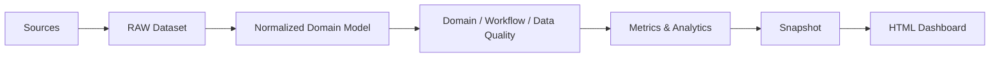

# Vision

## Statut

**FAIT / VISION PARTAGÉE** — synthèse des sources du projet et des échanges.

## Finalité

Le projet vise à construire un outil de suivi de la qualité et du fonctionnement de plusieurs bibliothèques de Design System à partir de données GitHub, avec une restitution sous forme de dashboard.

Le projet ne se limite pas au comptage de tickets. Les spécifications demandent notamment de suivre les composants, les audits d'accessibilité, les anomalies, les versions, les itérations/sprints, les délais, la vélocité et la conformité. `specifications/indicateurs-souhaites.md` demande également des indicateurs relatifs aux applications utilisatrices du Design System et à leur fréquence d'utilisation.

## Vision d'architecture retenue pour la phase actuelle

La réalisation actuelle reste volontairement simple : TypeScript, JSON, snapshots et HTML généré.

## Évolution souhaitée

Le modèle doit permettre ultérieurement de remplacer ou compléter le stockage et la restitution par une API, un backend, une base de données et/ou un frontend sans réécrire les règles métier et le modèle normalisé.

**Attention :** cette possibilité est une orientation d'architecture issue des échanges ; elle n'est pas une fonctionnalité actuellement implémentée.
