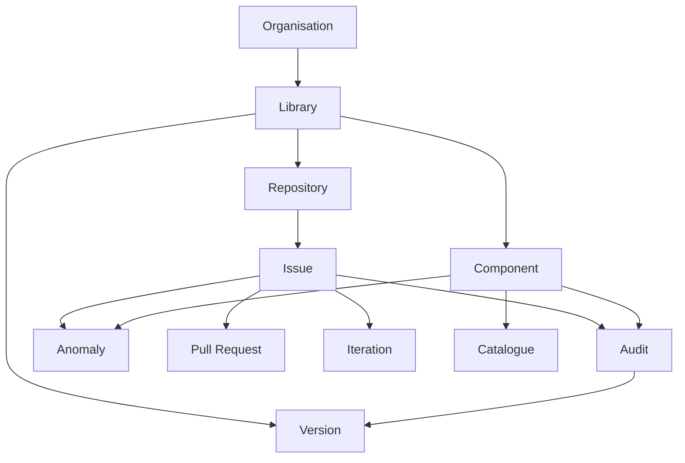

# Modèle métier de référence

## Statut

**BASE DE TRAVAIL**. Ce document sépare les objets observés dans le code des objets demandés par les spécifications.

## Modèle actuel normalisé

Le code actuel expose :

```text
NormalizedData
├── libraries[]
├── components[]
├── audits[]
├── anomalies[]
└── pullRequests[]
```

Le snapshot conserve également le `RawDataset` et les décisions DQ.

## Modèle métier cible discuté



**Important :** le schéma ci-dessus contient des concepts demandés ou discutés qui ne sont pas tous des objets implémentés aujourd'hui. Les différences sont documentées dans `docs/00-cadrage/perimetre.md`.

## Principes de séparation

- Issue Type = ce qu'est l'issue.
- Label = ce qui caractérise l'issue.
- Project status = où elle se trouve dans le workflow.
- Iteration = quand elle est planifiée.
- Milestone / version = à quel lot ou version elle appartient.
- Component = quel composant est concerné.
- Audit = dans quel contexte d'évaluation elle intervient.
- Pull Request = preuve technique de réalisation lorsque le workflow l'exige.
