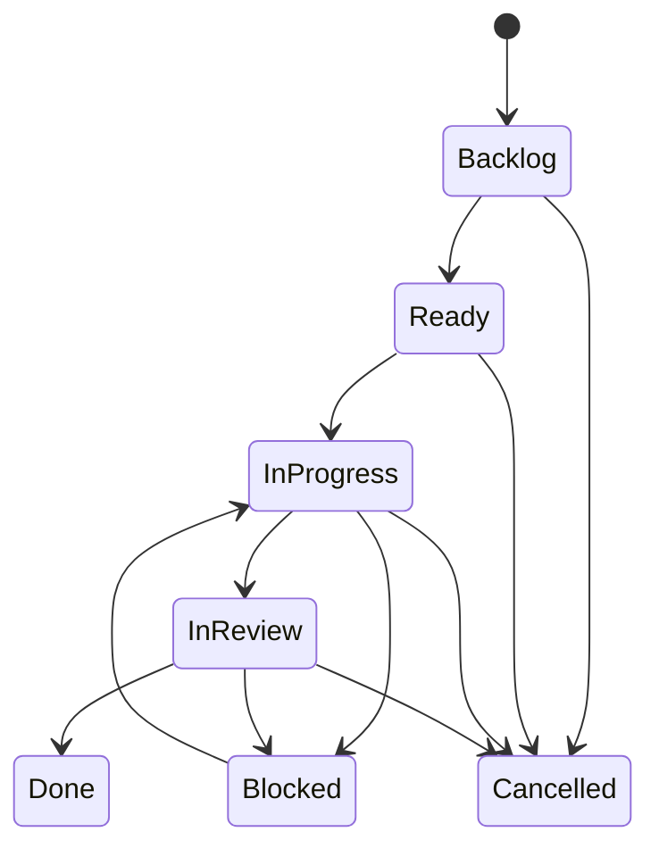

# Workflow

Le workflow décrit dans `specifications/gh-workflow.md` est riche et contient plusieurs profils d'issues.

## Workflow standard

**Attention :** ce diagramme synthétise le workflow général décrit dans la source. Les exceptions par type d'issue sont prioritaires et plusieurs transitions sont encore à confirmer.

## Profils identifiés

- Standard.
- Epic.
- Audit.
- Release.
- Conception.

Cette séparation par profil est une recommandation d'architecture issue des échanges, destinée à éviter l'application de règles universelles à des objets qui ont des contraintes différentes.
