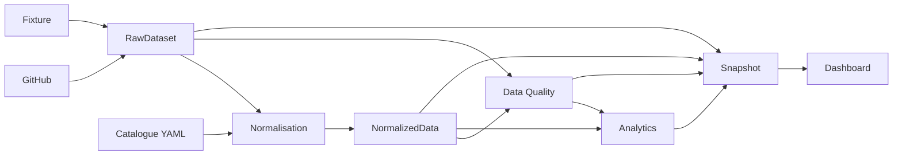

# Architecture des données

## Objectif

Cette page décrit les contrats de données qui traversent le pipeline
actuel.

Elle distingue les données collectées, le modèle normalisé, les
décisions de qualité, les métriques et le Snapshot. Elle décrit l'état
actuellement implémenté ; l'enrichissement du modèle métier issu des
décisions D-001 à D-136 sera traité dans une étape ultérieure.

## Vue d'ensemble



## Contrats par étape

---

Étape Entrée Sortie Couche logicielle
actuelle

---

Collecte Fixture ou API `RawDataset` `src/collectors/`
GitHub

Référence YAML catalogue Catalogue validé `src/catalogue.ts`

Normalisation RAW + catalogue + `NormalizedData` `src/normalizers/`
configuration

Qualité RAW + normalisé + `DataQualityIssue[]` `src/quality/`
règles

Analyse Normalisé + métriques / `src/analytics/`
impacts DQ `Analytics`

Snapshot RAW + normalisé + `Snapshot` `src/snapshots/`
DQ + analytics

Restitution Snapshot HTML / JS / CSS `src/dashboard/`
---

## RawDataset

Le RAW est le contrat d'entrée interne du pipeline.

Il conserve une représentation minimale mais proche des données
nécessaires issues de GitHub : repositories, Issues, Pull Requests,
labels, dates, relations, statuts Project et Milestones.

Le catalogue de référence est également injecté dans le jeu de données
via `catalogueComponents` avant la normalisation.

Le RAW n'est pas le modèle métier cible. Il conserve les éléments
nécessaires pour pouvoir expliquer et rejouer les transformations
ultérieures.

Voir [RAW Dataset](raw-dataset.md).

## Catalogue

Le catalogue YAML constitue une source de référence distincte de GitHub.

Il est chargé et validé avant la normalisation. Il permet notamment
d'enrichir ou de rapprocher les Components détectés dans les données
collectées.

Le rôle métier cible du Catalogue, notamment son historisation par
Version, est décrit dans la documentation métier et reste plus riche que
l'implémentation actuelle.

## NormalizedData

Le modèle normalisé transforme les données sources en objets
indépendants de la structure de l'API GitHub.

Dans l'implémentation actuelle, il contient principalement :

- `Library` ;
- `Component` ;
- `Audit` ;
- `Anomaly` ;
- `PullRequest`.

Les relations utilisent des identifiants stables afin de relier
Components, Audits, Anomalies et Pull Requests.

Les entités normalisées conservent également leur provenance et un état
de qualité.

Voir [Modèle normalisé](modele-normalise.md).

## Data Quality

Les règles de qualité observent le RAW et le modèle normalisé et
produisent des `DataQualityIssue`.

Principe important :

> une alerte de qualité ne supprime ni ne réécrit silencieusement la
> donnée source.

L'implémentation actuelle distingue notamment des impacts de métrique de
type :

- `include` : la donnée peut rester dans le calcul, avec une fiabilité
  potentiellement dégradée ;
- `exclude` : la donnée est exclue du périmètre d'une métrique
  concernée ;
- `unknown` : la métrique concernée ne peut pas être considérée comme
  connue.

Les règles DQ actuellement implémentées décrivent l'état du logiciel ;
elles ne constituent pas encore la matrice métier cible issue de la
consolidation D-001 à D-136.

## Analytics

La couche Analytics calcule les métriques à partir du modèle normalisé
et des impacts DQ.

Une métrique doit pouvoir distinguer une valeur calculable d'une valeur
inconnue. Le modèle utilise notamment la valeur `unknown` lorsque la
donnée disponible ne permet pas de produire un résultat fiable.

Les métriques V2 portent leur propre périmètre, provenance, fiabilité et
exclusions. La fiabilité doit donc être comprise au niveau de la
métrique et non uniquement comme un état global du Snapshot.

## Snapshot

Le Snapshot regroupe dans une enveloppe traçable :

- le RAW ;
- le modèle normalisé ;
- les résultats DQ ;
- les analytics ;
- la version du modèle ;
- la version des règles ;
- les informations de fiabilité.

Il constitue le contrat actuel entre le pipeline de calcul et les
consommateurs tels que le dashboard.

Voir [Snapshots](snapshots.md).

## Découplage

Le dashboard n'est pas une source de vérité métier.

```text
Sources
  ↓
RAW
  ↓
Normalisation
  ↓
Data Quality
  ↓
Analytics
  ↓
Snapshot
  ↓
Dashboard
```

Le dashboard consomme les résultats du pipeline. Les règles métier, les
règles de qualité et les formules de métriques ne doivent pas être
réimplémentées dans la couche de restitution.

## Évolution

Cette architecture de données doit permettre de faire évoluer les
sources, la persistance ou l'interface sans déplacer les règles métier
dans le stockage ou le frontend.

Voir [Évolution vers API / backend / base de
données](evolution-vers-backend.md).
