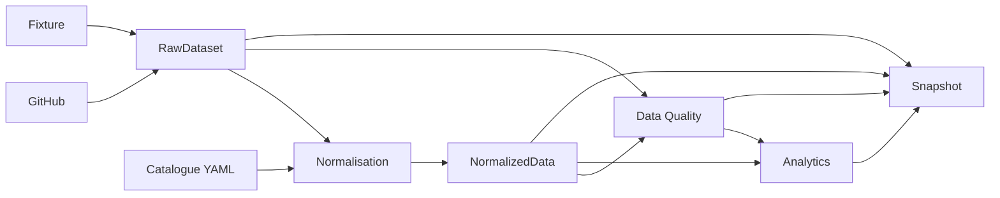

# Architecture des données

## Contrats

### RawDataset

Conserve une représentation minimale des données nécessaires : repositories, issues, PR, catalogueComponents et disponibilité Nexus.

### NormalizedData

Représente les entités métier : libraries, components, audits, anomalies et pull requests.

### Snapshot

Regroupe RAW, données normalisées, DQ, analytics, version du modèle, version des règles et fiabilité.

## Principe de découplage

Le dashboard ne doit pas devenir la source de vérité métier. Il est un consommateur d'un snapshot analytique.
