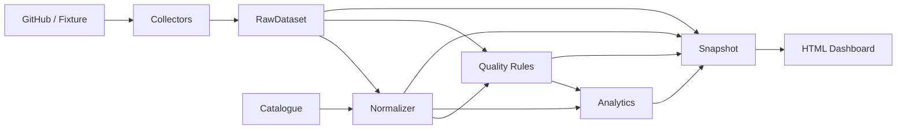

# Architecture logicielle actuelle

Le projet est un pipeline Node.js + TypeScript en lecture seule.

## Principales responsabilités

- `src/cli.ts` : CLI.
- `src/pipeline.ts` : orchestration.
- `src/collectors/` : collecte.
- `src/catalogue.ts` : catalogue.
- `src/normalizers/` : normalisation.
- `src/quality/` : DQ.
- `src/analytics/` : métriques et flows.
- `src/snapshots/` : snapshots/diff.
- `src/dashboard/` : rendu HTML.
- `src/domain/types.ts` : contrats.
