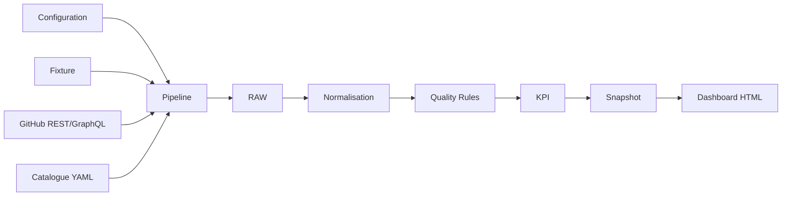

```mermaid
flowchart TD

subgraph group_entry["Exécution et configuration"]
  node_cli["CLI<br/>[cli.ts]"]
  node_pipeline["Orchestrateur<br/>[pipeline.ts]"]
  node_config["Configuration<br/>[config.ts]"]
  node_systemcfg["Réglages système<br/>[system.yaml]"]
  node_dqcfg["Règles qualité<br/>[quality-rules.yaml]"]
end

subgraph group_collection["Sources et collecte"]
  node_catalogue["Catalogue composants<br/>[catalogue.ts]"]
  node_cataloguefile["Catalogue référentiel<br/>[catalogue.yaml]"]
  node_fixture["Collecteur fixture<br/>[fixture.ts]"]
  node_fixturedata["Données démo<br/>[github.json]"]
  node_githubcollector["Collecteur GitHub<br/>[github.ts]"]
  node_raw["Données RAW<br/>[types.ts]"]
end

subgraph group_processing["Traitement métier"]
  node_normalizer["Normalisation métier<br/>[github.ts]"]
  node_quality["Contrôles DQ<br/>[rules.ts]"]
  node_analytics["Calcul des KPI<br/>[kpis.ts]"]
  node_model["Modèle métier<br/>[types.ts]"]
end

subgraph group_outputs["Résultats et restitution"]
  node_snapshotbuilder["Assemblage snapshot<br/>[snapshot.ts]"]
  node_snapshotstore["Snapshots JSON<br/>[snapshot.json]"]
  node_runstore["Historique snapshots"]
  node_dashboardgen["Générateur dashboard<br/>[generate.ts]"]
  node_dashboardui["Pages et assets"]
  node_dashboardfiles["Dashboard statique<br/>[index.html]"]
end

node_operator(("Opérateur"))
node_github(("GitHub REST / GraphQL"))
node_browser(("Navigateur"))

node_operator -->|"lance"| node_cli
node_cli -->|"exécute"| node_pipeline
node_pipeline -->|"charge"| node_config
node_config -->|"lit"| node_systemcfg
node_config -->|"lit"| node_dqcfg
node_pipeline -->|"charge"| node_catalogue
node_catalogue -->|"lit et valide"| node_cataloguefile
node_pipeline -->|"sélectionne"| node_fixture
node_fixture -->|"lit"| node_fixturedata
node_pipeline -.->|"sélectionne"| node_githubcollector
node_githubcollector -.->|"collecte en lecture seule"| node_github
node_fixture -->|"retourne RAW"| node_raw
node_githubcollector -.->|"retourne RAW"| node_raw
node_pipeline -->|"injecte les composants"| node_catalogue
node_pipeline -->|"normalise"| node_normalizer
node_normalizer -->|"lit"| node_raw
node_normalizer -->|"enrichit depuis"| node_catalogue
node_normalizer -->|"produit"| node_model
node_pipeline -->|"évalue"| node_quality
node_quality -->|"compare au RAW"| node_raw
node_quality -->|"contrôle"| node_model
node_pipeline -->|"calcule"| node_analytics
node_analytics -->|"analyse"| node_model
node_analytics -->|"applique exclusions"| node_quality
node_pipeline -->|"assemble"| node_snapshotbuilder
node_snapshotbuilder -->|"embarque"| node_raw
node_snapshotbuilder -->|"embarque"| node_model
node_snapshotbuilder -->|"embarque alertes"| node_quality
node_snapshotbuilder -->|"embarque KPI"| node_analytics
node_pipeline -->|"écrit courant"| node_snapshotstore
node_pipeline -->|"écrit historique"| node_runstore
node_pipeline -->|"génère depuis snapshot"| node_dashboardgen
node_dashboardgen -->|"copie les assets"| node_dashboardui
node_dashboardgen -->|"écrit les pages"| node_dashboardfiles
node_browser -->|"consulte"| node_dashboardfiles

click node_cli "https://github.com/bdelion/design-system-quality-pipeline/blob/main/src/cli.ts"
click node_pipeline "https://github.com/bdelion/design-system-quality-pipeline/blob/main/src/pipeline.ts"
click node_config "https://github.com/bdelion/design-system-quality-pipeline/blob/main/src/config.ts"
click node_systemcfg "https://github.com/bdelion/design-system-quality-pipeline/blob/main/config/system.yaml"
click node_dqcfg "https://github.com/bdelion/design-system-quality-pipeline/blob/main/config/quality-rules.yaml"
click node_catalogue "https://github.com/bdelion/design-system-quality-pipeline/blob/main/src/catalogue.ts"
click node_cataloguefile "https://github.com/bdelion/design-system-quality-pipeline/blob/main/config/catalogue.yaml"
click node_fixture "https://github.com/bdelion/design-system-quality-pipeline/blob/main/src/collectors/fixture.ts"
click node_fixturedata "https://github.com/bdelion/design-system-quality-pipeline/blob/main/fixtures/github.json"
click node_githubcollector "https://github.com/bdelion/design-system-quality-pipeline/blob/main/src/collectors/github.ts"
click node_raw "https://github.com/bdelion/design-system-quality-pipeline/blob/main/src/domain/types.ts"
click node_normalizer "https://github.com/bdelion/design-system-quality-pipeline/blob/main/src/normalizers/github.ts"
click node_quality "https://github.com/bdelion/design-system-quality-pipeline/blob/main/src/quality/rules.ts"
click node_analytics "https://github.com/bdelion/design-system-quality-pipeline/blob/main/src/analytics/kpis.ts"
click node_model "https://github.com/bdelion/design-system-quality-pipeline/blob/main/src/domain/types.ts"
click node_snapshotbuilder "https://github.com/bdelion/design-system-quality-pipeline/blob/main/src/snapshots/snapshot.ts"
click node_snapshotstore "https://github.com/bdelion/design-system-quality-pipeline/blob/main/data/current/snapshot.json"
click node_runstore "https://github.com/bdelion/design-system-quality-pipeline/tree/main/data/current"
click node_dashboardgen "https://github.com/bdelion/design-system-quality-pipeline/blob/main/src/dashboard/generate.ts"
click node_dashboardui "https://github.com/bdelion/design-system-quality-pipeline/tree/main/src/dashboard/assets"
click node_dashboardfiles "https://github.com/bdelion/design-system-quality-pipeline/blob/main/data/dashboard/index.html"

classDef toneNeutral fill:#f8fafc,stroke:#334155,stroke-width:1.5px,color:#0f172a
classDef toneBlue fill:#dbeafe,stroke:#2563eb,stroke-width:1.5px,color:#172554
classDef toneAmber fill:#fef3c7,stroke:#d97706,stroke-width:1.5px,color:#78350f
classDef toneMint fill:#dcfce7,stroke:#16a34a,stroke-width:1.5px,color:#14532d
classDef toneRose fill:#ffe4e6,stroke:#e11d48,stroke-width:1.5px,color:#881337
classDef toneIndigo fill:#e0e7ff,stroke:#4f46e5,stroke-width:1.5px,color:#312e81
classDef toneTeal fill:#ccfbf1,stroke:#0f766e,stroke-width:1.5px,color:#134e4a
class node_cli,node_pipeline,node_config,node_systemcfg,node_dqcfg toneBlue
class node_catalogue,node_cataloguefile,node_fixture,node_fixturedata,node_githubcollector,node_raw toneAmber
class node_normalizer,node_quality,node_analytics,node_model toneMint
class node_snapshotbuilder,node_snapshotstore,node_runstore,node_dashboardgen,node_dashboardui,node_dashboardfiles toneRose
class node_operator,node_github,node_browser toneIndigo
```

# Architecture

Le projet est un pipeline Node.js/TypeScript en lecture seule. Il collecte des données, les traduit dans un modèle métier stable, mesure leur qualité, calcule des indicateurs et produit un snapshot ainsi qu'un dashboard statique.

## Responsabilités

- `src/cli.ts` expose les commandes utilisateur.
- `src/pipeline.ts` orchestre les étapes sans porter les détails des sources.
- `src/collectors/` produit un `RawDataset` depuis une fixture ou GitHub.
- `src/catalogue.ts` valide la référence YAML des composants.
- `src/normalizers/` convertit les données RAW en modèle métier.
- `src/quality/` détecte les problèmes sans supprimer les données sources.
- `src/analytics/` calcule les KPI sur les objets admissibles.
- `src/snapshots/` assemble une sortie immuable et traçable.
- `src/dashboard/` génère des pages HTML statiques.
- `src/domain/types.ts` définit les contrats partagés entre ces couches.

## Principes

- Les sources ne sont jamais modifiées.
- Une donnée invalide reste visible et porte une décision de qualité.
- Chaque entité normalisée conserve sa provenance.
- Les KPI distinguent une valeur calculable d'une valeur inconnue.
- Les sorties sont rejouables avec la version du modèle et des règles.

## Schéma v2

> ℹ️ https://gitdiagram.com/bdelion/design-system-quality-pipeline

Ce dépôt est un pipeline de pilotage de la qualité des Design Systems : il collecte des données GitHub ou de démonstration, les transforme en modèle métier, évalue leur qualité, calcule des KPI, puis conserve un snapshot et produit un dashboard statique. Le pipeline orchestre ces étapes ; les résultats exposent notamment anomalies, audits, composants, fiabilité et délais de correction. Les relations suivent l’orchestration documentée et le code échantillonné ; les détails internes non échantillonnés sont représentés au niveau de leur répertoire.

Ce dépôt est un pipeline de pilotage de la qualité des Design Systems : il collecte des données GitHub ou de démonstration, les transforme en modèle métier, évalue leur qualité, calcule des KPI, puis conserve un snapshot et produit un dashboard statique. Le pipeline orchestre ces étapes ; les résultats exposent notamment anomalies, audits, composants, fiabilité et délais de correction. Les relations suivent l’orchestration documentée et le code échantillonné ; les détails internes non échantillonnés sont représentés au niveau de leur répertoire.

