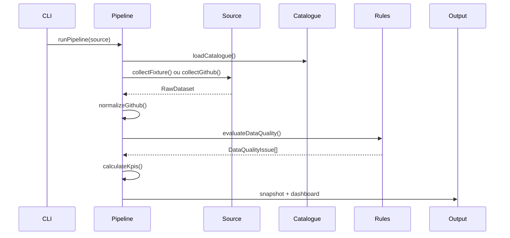

# Workflow d'exécution

`runPipeline` suit toujours le même ordre, quelle que soit la source choisie.

1. Charger `config/system.yaml` et les variables d'environnement.
2. Charger et valider `config/catalogue.yaml`.
3. Collecter la fixture ou les repositories GitHub.
4. Injecter les noms du catalogue dans le dataset RAW.
5. Conserver les statuts Project et les milestones sur chaque issue.
6. Vérifier que tous les repositories configurés sont présents.
7. Normaliser libraries, composants, audits, anomalies et pull requests.
8. Évaluer les Quality Rules, avec un traitement dédié des issues annulées.
9. Calculer les KPI en tenant compte des exclusions et des issues annulées.
10. Construire le snapshot avec provenance, versions et fiabilité.
11. Écrire le snapshot courant, l'historique et le dashboard.

Une exécution `PARTIAL` est terminée : elle indique qu'au moins une réserve de qualité existe. `FAILED` est réservé aux erreurs d'exécution qui empêchent la production du snapshot.
