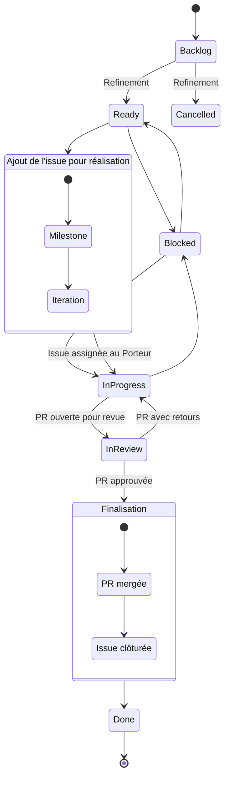
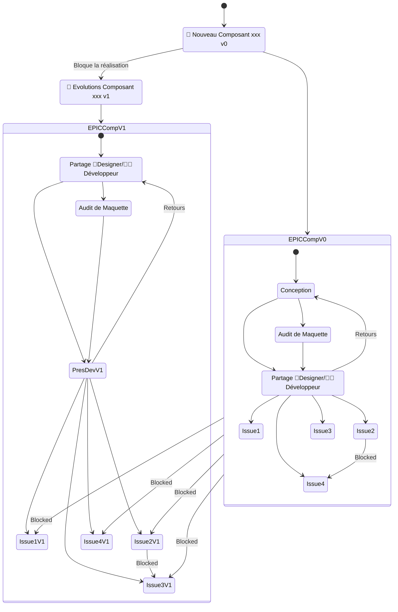

# GitHub Worflow et autres éléments de repo et project

## Taxonomie

| Mécanisme            | Responsabilité                              |
| -------------------- | ------------------------------------------- |
| Issue Type           | Nature de l'objet                           |
| Label                | Classification / contexte                   |
| GitHub Project       | Workflow, sprint, estimation, planification |
| Catalogue            | Référentiel des composants                  |
| GitHub Release / Tag | Publication technique                       |

## Issue type - Définition

**Issue Type GH** = nature de l'issue traitée

Voici la liste des issue type :

- 🔧Task : Travail unitaire à réaliser ne correspondant pas à une anomalie, une évolution fonctionnelle ou un audit.
- 🐛Bug : Dysfonctionnement, comportement inattendu ou non-conformité constatée nécessitant une correction.
- ✨Feature : Nouvelle capacité, nouveau besoin métier ou évolution significative apportant de la valeur aux utilisateurs.
- 🚀Epic : Initiative de grande ampleur regroupant plusieurs travaux, audits, anomalies ou évolutions liés à un objectif commun.
- 🔍Audit : Analyse structurée d'un composant, d'une fonctionnalité ou d'un périmètre visant à évaluer sa conformité ou sa qualité selon des critères définis. **--> faut-il prévoir autre chose pour différencier un type d'audit par rapport à un autre, exemple accessibilité et sécurité ou qualité ou design**
- 🔖Release : Préparation, validation, publication et communication d'une version du produit ou d'une librairie.
- ❓Question : Demande d'information, clarification ou arbitrage ne nécessitant pas immédiatement un développement.
- 📝Documentation : Création ou mise à jour de contenu documentaire destiné aux développeurs ou utilisateurs **--> à séparer de la réalisation systématiquement ? afin que le maker du code ne soit pas celui qui fasse la doc et donc qu'un autre embarque ?**
- 🧠Conception : Étude, cadrage ou conception préalable permettant de définir une solution avant sa mise en œuvre.

## Label - Définition

**Label GH** = classification, contexte ou caractéristique.

Liste complète à venir mais voici déjà des éléments :

- pour une issue qui vient d'être créée et qui n'a pas encore été raffinée : `📌 Grooming` ou `🔎 Grooming`
- pour une issue trop grosse et/ou à transformer en Epic : `✂️ action:split`
- pour une issue de support : `🤝 support` et à associer à l'issue type `🔧Task`
- pour une issue rapportée par un utilisateur (Dev, Design, ...) : `👤 reported:user`
- pour un composant `xxx` et avec le prefix `🧩 Component:` : `🧩 Component:xxx`
- pour un hook `titi` et avec le prefix `🪝 hook:` : `🪝 hook:titi`
- pour les retours sur les audits d'accessibilité, la criticité peut avoir 3 valeurs `bloquante: "blocking"`, `majeure: "major"` et `mineure: "minor"` avec le prefix `🚦 rgaa:` ce qui nous donne 3 labels :
  - `🚦 rgaa:bloquante`
  - `🚦 rgaa:majeure`
  - `🚦 rgaa:mineure`
- pour les retours sur les audits d'accessibilité, la catégorisation peut avoir différente valeuravec le prefix `♿ a11y:` ce qui nous donne pour une catégorie `toto` le label `♿ a11y:toto`
- pour des attendus sur les souhaits et l'expérience de dev, un préfixe `🧑‍💻 dx:`, avec par exemple `🧑‍💻 dx:developer-experience`
- pour des attendus et des priorités designer, un prefixe `🎨 ux:`, notamment par exemple `🎨 ux:designer-priority` ou `🎨 ux:need-identified` ou `🎨 ux:design`
- pour la gestion des priorités dans la backlog et en plus de mettre en place des milestones qui ne suivraient pas les versions mais des priorités par trimestre, des labels :
  - `🔥 priority:P1`
  - `🔥 priority:P2`
  - `🔥 priority:P3`
  - `🧊 priority:P99999` pour les issues non prioritaires
- pour des sujets techniques, un prefix `🛠️ tech:` comme par exemple `🛠️ tech:ci` ?
- pour des sujets autours de la qualité, un prefix `🧪 quality:` comme par exemple `🧪 quality:sonar`, `🧪 quality:tests`, ...
- pour traiter dependabot et les dépendances en général, un label (voir un prefixe) `🔗 dependency`
- pour les issues en doublon, non valide, qu'on ne veut pas traiter et donc qui aurait un status `Cancelled` :
  - `🚫 resolution:wontfix`
  - `🚫 resolution:duplicate`
  - `🚫 resolution:invalid`

Liste des labels à challenger :

- `New component` : est ce qu'il faut un label si l'issue type `✨Feature` ne suffit pas ?
- `New enhancement` : est ce qu'il faut un label si l'issue type `✨Feature` ne suffit pas ?
- `📚 documentation` abandonné au profit de l'issue type `📝Documentation`
- `👥 event:coding-days` : une catégorie comme celle-ci a-t-elle toujours un intérêt ? on la crée pour la reprise sur le patrimoine existant ?
- `🌍 scope:open-source` : pour des issues qui adresseraient ce point
- `🚀 release:breaking` : pour des issues où l'on identifie l'arrivée d'un breaking change et donc une montée de version majeure nécessaire

### Palette de couleur associée

| Famille         | Emoji | HEX     |
| --------------- | ----- | ------- |
| Component       | 🧩    | #0969DA |
| a11y            | ♿    | #8250DF |
| RGAA bloquante  | 🚦    | #CF222E |
| RGAA majeure    | 🚦    | #BC4C00 |
| RGAA mineure    | 🚦    | #9A6700 |
| Priority        | 🔥    | #D97706 |
| Priority frozen | 🧊    | #57606A |
| Tech            | 🛠️    | #6E7781 |
| Quality         | 🧪    | #1A7F37 |
| DX              | 🧑‍💻    | #BF3989 |
| UX              | 🎨    | #C18401 |
| Action          | ✂️    | #A40E26 |
| Workflow        | 🔎    | #0891B2 |
| Documentation   | 📚    | #1E3A8A |
| Support         | 🤝    | #0F766E |
| Reported        | 👤    | #64748B |
| Dependency      | 🔗    | #4F46E5 |
| Resolution      | 🚫    | #8C959F |
| Release         | 🚀    | #0D9488 |
| Hook            | 🪝    | #475569 |
| Event           | 👥    | #92400E |
| Scope           | 🌍    | #15803D |

## Projects

### Velocity

La vélocité d'une issue peut prendre les valeurs : 0.5, 1, 2, 3, 5, 8.
Au delà de 8, l'issue doit être découper et donc avoir automatiquement le label `✂️ action:split`.
Que fait-on comment distinsctions entre velocité vide et vélocité égale à 0 ? :

- Epic
- R&D
- Audit accessibilité
- POC
- ...

### Itération/Sprint

Une issue doit être dans une itération pour pouvoir est prise en charge et donc passer de `Ready` à `In progress`.
Les itérations se font sur 3 semaines du lundi au vendredi.
Les itérations sont incrémentées. Nous sommes à la 54 qui se termine le 02/10/2026.
Une issue qui n'est pas close (`Done` ou `Cancelled`) peut :

- passer à l'itération suivante
- passer dans une autre itération plus éloignée
- se voir retirer l'itération sans en avoir d'autre mais dans ce cas et si elle n'est pas abandonnée (`Cancelled` et `🚫 resolution::xxx`), il faudrait changer son status (passer à `Backlog`) et mettre un label `🔎 Grooming` ? ou alors mettre un label dédié ?

### Status

Les status actuels :

- Backlog
- Ready
- In progress
- In review
- Done
- Blocked
- Cancelled

#### Une issues avec le status `Backlog`

- doit avoir un label `🔎 Grooming` et un ou plusieurs labels pour classifier/caractériser
- doit avoir une Velocity vide
- ne peut pas être dans une itération/sprint
- ne peut pas être dans une Milestone/Version/Release
- ne peut pas avoir de branche rattachée
- ne peut pas avoir de PR rattachée
- ne doit pas être close
- ne doit pas avoir d'assignees

#### Une issue avec le status `Ready`

- ne peut pas avoir de Velocity vide ou <= à 0 sauf si il s'agit d'une issue parent qui a une issue type `🚀Epic` ... à voir pour le "0" si on l'accepte quand il s'agit de ticket d'audit, de R&D, de POC, ...
- ne peut plus avoir de label `🔎 Grooming`
- doit avoir une issue type et au moins un label
- peut-être dans une itération/sprint
- peut-être dans une milestone/version
- ne peut pas avoir de branche rattachée
- ne peut pas avoir de PR rattachée
- ne doit pas être close
- peut avoir un assigne si elle est dans une itération/sprint

#### Une issue avec le status `In progress`

- ne peut pas avoir de Velocity vide ou <= à 0 sauf si il s'agit d'une issue parent qui a une issue type `🚀Epic` ... à voir pour le "0" si on l'accepte quand il s'agit de ticket d'audit, de R&D, de POC, ...
- ne peut plus avoir de label `🔎 Grooming`
- doit avoir une issue type et au moins un label pour classifier/caractériser
- doit être dans une itération/sprint
- doit être dans une milestone/version
- doit avoir une branche rattachée
- ne peut pas avoir de PR rattachée sauf il est en "Draft"
- ne doit pas être close
- doit avoir au moins un assignee de la Squad et peut avoir un assignee en dehors de la Squad pour identifier les contributeurs

#### Une issue avec le status `In review`

- ne peut pas avoir de Velocity vide ou <= à 0 sauf si il s'agit d'une issue parent qui a une issue type `🚀Epic` ... à voir pour le "0" si on l'accepte quand il s'agit de ticket d'audit, de R&D, de POC, ...
- ne peut plus avoir de label `🔎 Grooming`
- doit avoir une issue type et au moins un label pour classifier/caractériser
- doit être dans une itération/sprint
- doit être dans une milestone/version
- doit avoir une branche rattachée
- doit avoir de PR rattachée
- ne doit pas être close
- doit avoir au moins un assignee de la Squad et peut avoir un assignee en dehors de la Squad pour identifier les contributeurs

#### Une issue avec le status `Done`

- ne peut pas avoir de Velocity vide ou <= à 0 sauf si il s'agit d'une issue parent qui a une issue type `🚀Epic` ... à voir pour le "0" si on l'accepte quand il s'agit de ticket d'audit, de R&D, de POC, ...
- ne peut plus avoir de label `🔎 Grooming`
- doit avoir une issue type et au moins un label pour classifier/caractériser
- doit être dans une itération/sprint
- doit être dans une milestone/version
- doit avoir une branche rattachée
- doit avoir de PR rattachée
- doit être close
- doit avoir au moins un assignee de la Squad et peut avoir un assignee en dehors de la Squad pour identifier les contributeurs

#### Une issue avec le status `Blocked`

- ne peut pas avoir de Velocity vide ou <= à 0 sauf si il s'agit d'une issue parent qui a une issue type `🚀Epic` ... à voir pour le "0" si on l'accepte quand il s'agit de ticket d'audit, de R&D, de POC, ...
- ne peut plus avoir de label `🔎 Grooming`
- doit avoir une issue type et au moins un label pour classifier/caractériser
- doit être dans une itération/sprint
- doit être dans une milestone/version
- peut avoir une branche rattachée
- ne peut pas avoir de PR rattachée sauf il est en "Draft"
- ne doit pas être close
- doit avoir au moins un assignee de la Squad et peut avoir un assignee en dehors de la Squad pour identifier les contributeurs

#### Une issue avec le status `Cancelled`

- doit avoir un label `🚫 resolution:xxx`
- doit avoir une issue type et au moins un label pour classifier/caractériser
- doit avoir une Velocity vide ?
- ne peut pas être dans une Milestone/Version/Release
- ne peut pas avoir de branche rattachée ?
- ne peut pas avoir de PR rattachée ou alors une PR non mergée et close ?
- doit être close
- doit avoir au moins un assignee de la Squad et peut avoir un assignee en dehors de la Squad pour identifier les contributeurs

## Milestone

Les milestones peuvent être de différentes forme :

- une milestone qui identifie et regroupes les issues d'une version/release aura un titre qui respecte le SemVer `M.m.r` pour regrouper toutes les issues associées à la version
- une milestone qui identifie et regroupes les issues d'audit d'accessibilité d'une version `M.m.r` déjà en "PROD" pourrait avoir un titre de la forme `M.m.r-Audit` si les audits sont réalisés à postriori.
- une milestone peut avoir aussi d'autre titre qui ne catactérise pas de version mais des regroupements futurs pour identier des horizons de prise en charge comme par exemple :
  - `2026 T1` pour identifier le 1er trimestre de 2026 et donc avoir la forme `aaaa Tx` pour l'année `aaaa` et le trimestre `x` qui peut prendre les valeurs 1, 2, 3 ou 4
  - `2027 S1` pour identifier le 1er semestre de 2027 et donc avoir la forme `aaaa Sy` pour l'année `aaaa` et le semestre `y` qui peut prendre les valeurs 1 ou 2
  - `2026 - Design M1` pour identifier les retours de priorités des Designers et donc avoir la forme `aaaa - Design Mz` pour l'année `aaaa` et le lot de priorité croissante `z` qui peut-être un nombre
- une milestone n'a pas nécessairement de "Due date", à voir si cela a un intérêt
- une milestone n'a pas eu dans le passé de description mais nous essayons maintenant d'y mettre les objectifs afin d'éviter trop de déviation dans son contenu

## Relationships GH

- la notion de "parent" permet de faire par exemple une relation entre une issue et son issue "EPIC" parent qui permet de voir un tout cohérent souhaité
- les notions "Blocked by" et "Blocking" permettent de voir les dépendances entre issues et de faire en sorte de traiter les points dans le bonne ordre

## Development GH

- Cela permete de lier une issue à une branche ou une PR.
- Un lien vers la PR est essentiel lors du traitement de l'issue.
- Le lien vers la branche n'est pas obligatoire.

## Pull Request

- une PR peut-être en mode `Draft` si la ou les issues associées n'ont pas le status `In Review`
- une PR peut-être en mode  `Open` (et donc plus en `Draft`) si la ou les issues associées sont toutes avec le status `In Review`
- une PR doit avoir un assignee
- une PR en cours de relecture aura un à n reviewers
- une PR `Close` et `Merged` doit avoir :
  - un à n reviewers
  - au moins un approve de la part d'un des reviewers
  - toutes les discussions clôturées
  - tous les checks en vert/OK

## Issue de type spécifique

### Epic

- Une issue `🚀Epic` permet de décrire un tout cohérent attendu.
- Elle doit avoir au moins un label
- Elle peut être rattachée à une itération/sprint et à une milestone/version
- Elle contient une descirption clair du périmètre, de l'objectif, avec des DO et DONT.
- Elle a de 2 à n sub-issue rattacchées.
- Elle suit le workflow normal mais n'est pas pesée, c'est l'ensemble des sub-issue qui détermine le point de l'EPIC
- Elle peut bloquée ou être bloquée par une autre issue.
- Elle ne peut pas avoir de branche ou de PR rattachée.
- Elle est assignée au porteur du sujet, par défaut le PO de la Squad ?
- Elle passe de `Backlog` à `Ready` quand toutes les sub issues sont `Reday` **(:rotating_light: à déterminer)**
- Elle doit passé en `In progress` quand la 1ère sub issue passe en `In progress`
- Elle pourrait passé à l'état `In review` quand
  - toutes les issues sont `Done` ou `Cancelled`
  - la branche `release/M.m.r` est ouverte et correspond à la milesonte/version `M.m.r` de rattachement des issues et de l'EPIC
  - une version Release Candidate est disponible pour des tests par les clients à l'origine de la demande
- Elle pourrait passée à `Done` quand les retours des clients sont OK

### Audits accessiblité

#### Lot d'audit d'accessibilité

- Un lot d'audit d'accessibilité permet de faire un rattrapage d'audit quand il n'est pas fait au fil de l'eau des évolutions des composants
- Une EPIC d'accessibilité doit avoir :
  - l'issue type `🚀Epic`
  - une milestone
  - des sub issues pour chaque composant audité
- une issue d'audit d'accessibilité d'un composant est différente des autres issues
  - elle a la même milestone que sont issue `🚀Epic` parent.
  - elle a un issue type = `🔍Audit`
  - elle a un **label (:rotating_light: à déterminer)** pour identifier le type d'audit et dans ce cas "accessibilité"
  - elle a un label `🧩 Component:xxx` pour identifier le composant audité
  - elle est rattachée à l'auditeur
  - sa valocité est = à 0 actuellement, on verra par la suite si on pèse en fonction de la "taille" du comoposant
  - elle n'aura pas de branche et de PR associée
  - elle suite un worflow plus court :
    - pas de `backlog` et de pesée
    - directement `Ready`
    - passe à `In progress`
    - ne passe pas `In review`
    - passe à `Donne` et est clôturée
- lors du traitement d'une issue d'audit d'accessibilité, l'auditeur peut créé des sub issues enfant à cette issue pour ses retours

#### Audit de composant au fil de l'eau

A terme, la cible à mettre en place est la suivante :

- un composant évolue dans le cadre d'une milestone/version
- une issue d'audit d'accessibilité est créée
  - elle a la même milestone que les évolutions du composants.
  - elle a un issue type = `🔍Audit`
  - elle a un **label (:rotating_light: à déterminer)** pour identifier le type d'audit et dans ce cas "accessibilité"
  - elle a un label `🧩 Component:xxx` pour identifier le composant audité
  - elle est rattachée à l'auditeur
  - sa valocité est = à 0 actuellement, on verra par la suite si on pèse en fonction de la "taille" du comoposant
  - elle n'aura pas de branche et de PR associée
  - elle suite un worflow plus court :
    - elle reste à l'état `Backlog` et de pesée
    - elle passe à l'état `Ready` après l'ouverture de la branche `release/M.m.r` afin de faire un audit sur un périmètre arrêté
    - passe à `In progress`
    - ne passe pas `In review`
    - passe à `Donne` et est clôturée
  - elle bloque l'issue `🔖Release` qui correspond à la milestone/version
- lors du traitement d'une issue d'audit d'accessibilité, l'auditeur peut créé des sub issues enfant à cette issue pour ses retours

> :bulb: En fonction des retours de l'auditeur, la Squad doit choisir de traiter ou non les issues `🚦 rgaa:bloquante` et `🚦 rgaa:majeure` et `🚦 rgaa:mineure`. La règle reste à déterminer. Chaque issue sera ouverte sur une branche `bugix/nnn-rgaa-blqouante-clavier` créée à partir de la branche `release/M.m.r`.

#### Retours de l'auditeur sur un audit de composant

Lors d'un audit, l'auditeur peut faire 2 types de retours :

- des "non conformité"
- des améliorations

Ces issues seront des sub-issues de l'issue de l'audit.
Les issues "non conformité" impacteront les indicateurs du composant afin de déterminer si il est conforme ou non.
La version du composant non conforme pourrait déterminer par la milestone de l'issue parent d'audit.

#### Issue de retour d'audit "non conformité"

Ce type d'issue doit avoir à sa création :

- un "relationship" avec l'issue parent d'audit du composant `🧩 Component:xxx`
- le status `Backlog`
- l'issue type `🐛Bug`
- le label `🔎 Grooming`
- un des labels `🚦 rgaa:bloquante`, `🚦 rgaa:majeure` ou `🚦 rgaa:mineure`
- un label `♿ a11y:`
- un label `🧩 Component:xxx` qui doit être le même que le label `🧩 Component:xxx` de l'issue d'audit parent **(:rotating_light: normalement !)**
- **🚨 à voir ? un label en plus "accessibilité" ?**
- pas de milestone/version
- pas de vélocité
- pas d'itération/sprint
- un titre de la forme `♿ [xxx] - [Descriptif court]`
- une descritpion doit contenir idéalement :
  - **🚨 à voir ? éventuellement la version de l'audit du composant issue l'issue parent sinon voir la version de l'issue d'audit**
  - une capture d'écran ou une vidéo
  - une section "Problème"
  - une section "Solution"
  - tout **autre ?** section nécessaire

Cette issue suit ensuite le workflow classique d'une issue pour son traitement.

#### Issue de retour d'audit "amélioration"

Ce type d'issue doit avoir à sa création :

- un "relationship" avec l'issue parent d'audit du composant `🧩 Component:xxx`
- le status `Backlog`
- l'issue type `✨Feature`
- le label `🔎 Grooming`
- un label `???` **🚨 à voir ?** qui détermine le type d'amélioration
- un label `🧩 Component:xxx` qui doit être le même que le label `🧩 Component:xxx` de l'issue d'audit parent **(:rotating_light: normalement !)**
- **🚨 à voir ? un label en plus "accessibilité" ?**
- pas de milestone/version
- pas de vélocité
- pas d'itération/sprint
- un titre de la forme `♿ [xxx] - [Descriptif court]`
- une descritpion doit contenir idéalement :
  - **🚨 à voir ? éventuellement la version de l'audit du composant issue l'issue parent sinon voir la version de l'issue d'audit**
  - une capture d'écran ou une vidéo
  - une section "Problème"
  - une section "Solution"
  - tout **autre ?** section nécessaire

Cette issue suit ensuite le workflow classique d'une issue pour son traitement.

### Incidents

Une issue de type `🐛Bug` doit avoir à sa création tous les éléments d'une issue standard.
Elle doit avoir plus spécifiquement :

- un titre de la forme `🐛 [élément concerné] - [Descriptif court]`
- une descritpion qui contient :
  - la tribu et la squad qui déclare le bug
  - le Lead Dev rattaché à la Squad
  - le Designer rattaché à la Squad
  - le produit/l'application conerné qui utilise les librairies
  - les librairies et leurs versions utilisées par le produit/l'application
  - le lien vers le repository du produit/l'application
  - une capture d'écran ou une vidéo qui illustre le problème **MAIS** qui n'est pas du code
  - une section "Problème"
  - une section "Code" avec les éléments qui posent problème dans le code du produit/l'application

### Release

Une issue de type `🔖Release` suit le workflow classique d'une issue ou presque.

Elle doit avoir plus spécifiquement :

- un titre de la forme `🔖Release M.m.r`
- elle est rattachée la milestone/version `M.m.r`
- elle reste à l'état `Blocked` (ou `Backlog` ?) tant que toutes les autres issues de la milestone/version `M.m.r` ne sont pas `Done`
- elle devient `Ready` après un temps d'attente (plus ou moins long) sur les retours d'early adopters d'une version Release Candidate
- une descritpion qui contient :
  - le numérod de version
  - la branche source de la PR qui sera de la forme `releas/M.m.r` ou `hotfix/M.m.r`
  - la branche cible de la PR qui sera de la forme `master` ou `support/1.x.x.`
  - une information sur le mode opératoire à suivre avec un lien vers la documentation à jour
  - une checklist des principale action à réaliser
  - la checklist standard peut-être compléter durant la mise au point de la milestone/version par des points de vigilances à traiter plus particulièrement

### Conception

> :question: Doit on doubler ici tout ou partie des informations présentes dans l'EPIC ?

La création d'un nouveau composant ou l'évolution d'un composant se fait en plusieurs étapes.
La 1ère est la phase de conception côté Designer via la Guilde Design.
Une issue de type `🧠Conception` doit permettre de suivre les travaux de la Guilde Designer et permettre d'afficher au plus tôt une liste d'attendus de la Squad de réalisation des implémentations.
Cette issue doit avoir :

- un issue type `🧠Conception`
- un label `🔎 Grooming`
- un label `🧩 Component:xxx` pour le nouveau composant à mettre en place ou pour les évolutions d'un composant existant
- un label `New component` ou `New enhancement` **:rotating_light: si ils sont mis en place, voir questionnement dans la section Labels**
- un titre **:rotating_light:à revoir** `🧠 Nouveau composant xxx - v0` ou `🧠 Nouveau composant xxx - MVP` / `🧠 Nouveau composant xxx - v1` ou `🧠 composant xxx - Evolution [descriptif court]`
- une description avec :
  - les liens vers la documentation Figma, Zeroheight et tout autre source d'infomation pertinente pour la conception et l'accessibilité **🚨 Doublon avec l'EPIC ?**
  - les porteurs côté Designers **🚨 Doublon avec l'EPIC ?**
  - Definition of Ready
  - Definition of Done
    - :bulb: avec prise en compte des éléments nécessaires à minima pour le Dev
    - liens
    - DO et DONT
- Une checklist des points à contrôler, réunion à faire, audit de maquette réalisé (ou il s'agit d'une autre issue :smile:), ... **🚨 ou il s'agit d'issues bien distinctes**

### Autres

> **🚧 TODO toutes les issue type devrait avoir une description, un template et des règles associées**

## Workflow

Une issue doit suivre le workflow suivant :

1. suite à sa création via `New issue` ou depuis une `Discussions`, elle est à l'état `Backlog`
2. suite à une séance de backlog raffinement, elle est pesée et passe à l'état `Ready`
3. elle est affectée à une itération/sprint et à une milestone/version
4. elle est prise en charge par une personne qui se positionne en `Assignee` et cette personne la passe en `In progress`
5. quand le nécessaire est fait, elle passe en `In review` avec une PR associée (PR qui est en `Open` avec des `Revievers`)
6. quand la PR est approuvée, mergée et close, l'issue passe à `Done` et est clôturée.

Si les retours de la revue sont nombreux (ou pour d'autres raisons), une issue doit passer de `In review` à `In progress`.
Si le traitement de l'issue ou les retours de la revue posents problèmes ou question, une issue passe à `Blocked`.
Si une issue A est à une relation avec une issue B de type `Blocked by` et que l'issue B n'est pas `Done` alors l'issue A est `Blocked`.
Une issue peut passer à l'état `Cancelled` si nous l'abandonnons.

Une issue peut-être **réouverte (:rotating_light: ? ou on en crée une nouvelle et on référence elle qui est close ?)** mais elle doit repasser le worklfow complet et donc revenir à l'état `Backlog` avec le lanel `Grooming` et tout ce qui a déjà été indiqué sur le sujet.

### Création d'un nouveau composant

La création d'un nouveau composant peut se faire en plusieurs étapes afin de lotir les attendus des Designers et des Développeurs.
L'idée est de livrer rapidement dans une v0 le MVP puis des faire des v1, v2, v3, ... pour les autres éléments, petits et souvent.
La création d'un nouveau composant se fait sur le lot v0, les autres lots sont v1, v2, v3, ...
Le lot v0 blqoue le lot v1 qui bloque le lot v2 ... .

Une création de composant se caractérise d'abord par une issue EPIC (qui permettra de rattacher des sub issues) et qui doit avoir :

- un issue type 🚀Epic
- un label `🔎 Grooming`
- un label `🧩 Component:xxx` pour le nouveau composant à mettre en place
- un label `New component` **:rotating_light: si il est mis en place, voir questionnement dans la section Labels**
- un label "Contribution" **:rotating_light: si nous en mettons un en place**
- un titre **:rotating_light:à revoir** `✨ Nouveau composant xxx - v0` ou `✨ Nouveau composant xxx - MVP`
- une description avec :
  - les liens vers la documentation Figma, Zeroheight et tout autre source d'infomation pertinente pour la conception et l'accessibilité
  - une description
  - les porteurs côté Designers
  - éventuellement les contributeurs côté Développeurs
  - la liste des applications qui attendent le composant avec
    - la Tribu/Squad associée
    - le Designer et le Lead Dev de la Squad
    - les versions des libriairies utilisées
    - les dates de "Dev", "Recette" et "Mise en Prod" souhaitées et ce afin de mieux prioriser les sujets
    - les DO et DONT de la v0

Elle suit le workflow d'une EPIC comme décrit par ailleurs.

Dans ses sub issues rattachées, on trouvera au moins une sub issue de conception (qui bloquera toutes les autres issues de réalisation) ainsi que des sub issues de réalisation de dev, de mis en forme, de navigation clavier, d'accessibilité, ... .

### Evolution d'un composant existant

Une évolution de composant se caractérise d'abord par une issue EPIC (qui permettra de rattacher des sub issues) et qui doit avoir :

- un issue type `🚀Epic`
- un label `🔎 Grooming`
- un label `🧩 Component:xxx` pour le nouveau composant à mettre en place
- un label `New component` **:rotating_light: si il est mis en place, voir questionnement dans la section Labels**
- un label "Contribution" **:rotating_light: si nous en mettons un en place**
- un titre **:rotating_light:à revoir** `✨ Nouveau composant xxx - v1` ou `✨ composant xxx - Evolution [descriptif court]`
- une description avec :
  - les liens vers la documentation Figma, Zeroheight et tout autre source d'infomation pertinente pour la conception et l'accessibilité
  - une description
  - les porteurs côté Designers
  - éventuellement les contributeurs côté Développeurs
  - la liste des applications qui attendent le composant avec
    - la Tribu/Squad associée
    - le Designer et le Lead Dev de la Squad
    - les versions des libriairies utilisées
    - les dates de "Dev", "Recette" et "Mise en Prod" souhaitées et ce afin de mieux prioriser les sujets
    - les DO et DONT de la v0

Elle suit le workflow d'une EPIC comme décrit par ailleurs.

Dans ses sub issues rattachées, on trouvera au moins une sub issue de conception (qui bloquera toutes les autres issues de réalisation) ainsi que des sub issues de réalisation de dev, de mis en forme, de navigation clavier, d'accessibilité, ... .

Si il s'agit d'une évolution de composant (`✨ Nouveau composant xxx - v1`) qui fait suite à un MVP (`✨ Nouveau composant xxx - v0`) dans ce cas, en plus de la sub issue de `✨ Nouveau composant xxx - v1` qui bloque l'EPIC, l'EPIC `✨ Nouveau composant xxx - v0` bloque l'EPIC `✨ Nouveau composant xxx - v1`.

### Création et évolution d'un composant

### Décommissionnement

> **🚧 TODO**
